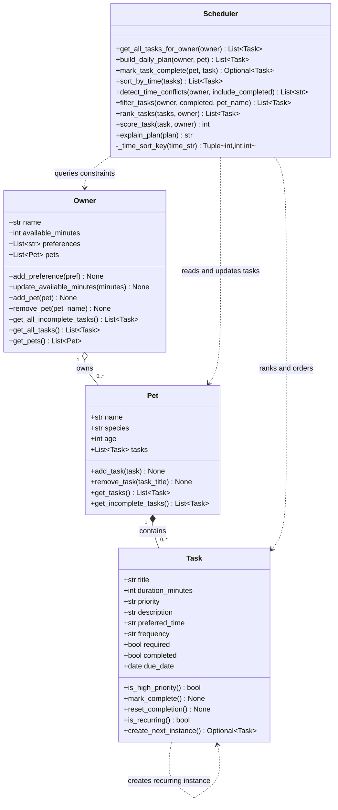

# PawPal+ Project Reflection

## 1. System Design

**a. Initial design**

My initial UML design focused on four core classes with clear responsibilities so the logic layer stays modular and easy to test.

- `Task` represents one care activity (for example feeding, walk, medication). It stores duration, priority, preferred time, and whether the task is required.
- `Pet` represents a single animal profile and owns the list of tasks that belong to that pet.
- `Owner` represents the person using the app and stores scheduling constraints such as available time and personal preferences.
- `Scheduler` is the decision-making class. It reads owner constraints and pet tasks, ranks tasks by importance/fit, and produces the final daily plan plus a short explanation.

The relationship model in the UML is: one owner manages one or more pets, each pet has zero or more tasks, and the scheduler depends on owner/pet/task data when generating the plan.

Here is the Mermaid.js class diagram representing this design:

**Core user actions**

- A user should be able to add and manage pet profiles so the system knows which pet needs care and what kind of care is appropriate.
- A user should be able to create and prioritize daily care tasks (like feeding, walks, medication, or playtime) with time estimates.
- A user should be able to generate and view today’s plan in order, so they can quickly see what to do next and when.

**b. Design changes**

Yes. I asked Copilot to review `#file:pawpal_system.py` for missing relationships and potential logic bottlenecks.

Based on that review, I made two refinements:

- I added the missing `Owner -> Pet` relationship in code by adding `pets` to `Owner` plus `add_pet` and `remove_pet` method stubs. This change keeps the implementation consistent with the UML association (`Owner "1" --> "1..*" Pet`).
- I added a `rank_tasks` method stub in `Scheduler` so task scoring/sorting can be centralized. The goal is to avoid scattering repeated scoring logic across multiple scheduling paths, which could become a bottleneck as task counts grow.

I made these changes to keep the design consistent, easier to maintain, and better prepared for scaling beyond a single pet or a very small task list.

---

## 2. Scheduling Logic and Tradeoffs

**a. Constraints and priorities**

My scheduler currently considers the following constraints:

- **Priority level** (`high`, `medium`, `low`) as the main urgency signal.
- **Required status** (`required=True`) to protect must-do care tasks.
- **Owner time budget** (`available_minutes`) so shorter, feasible tasks are favored.
- **Preferred time format** (`HH:MM`) for chronological sorting and conflict checks.
- **Completion status** (`completed`) so finished tasks are excluded from daily planning.

I treated constraints in this order because the app is a daily practical tool for pet care:

1. Health/safety first (`high` + `required` tasks).
2. Feasibility second (tasks that fit the owner's available time).
3. Convenience third (preferred time ordering and conflict visibility).

This is why `score_task()` heavily rewards priority and required tasks, while still giving a bonus to tasks that fit available minutes.

**b. Tradeoffs**

One tradeoff in my scheduler is conflict detection: it only flags tasks that share the exact same `preferred_time` string (for example, both at `08:30`). It does not yet calculate overlap by duration (for example, `08:30-09:00` colliding with `08:45-09:15`).

This tradeoff is reasonable for this project stage because it keeps the algorithm lightweight, easy to test, and easy to understand while still catching obvious clashes. I reviewed a more compact Pythonic rewrite, but I kept the clearer loop-based version because it is easier for humans to read and maintain in a student project.

---

## 3. AI Collaboration

**a. How you used AI**

I used VS Code Copilot in three main ways:

- **Design check:** I used chat to compare UML intent with implementation and identify missing relationships/methods.
- **Implementation support:** I used targeted prompts against specific files to add features in increments (sorting, conflict warnings, recurrence).
- **UI integration and docs:** I used Copilot to wire scheduler methods into Streamlit and then update README/diagram artifacts to match final code.

The most effective Copilot features for building the scheduler were:

- `#file:pawpal_system.py` prompts to reason about class responsibilities and method placement.
- `#codebase` prompts to align README feature claims with actual implemented algorithms.
- Fast iterative code edits with immediate test feedback (`pytest`) to validate each suggestion.

The most helpful prompts were specific and constraint-based, for example:

- "Review this file for missing relationships and scaling bottlenecks."
- "Use existing Scheduler methods in the UI instead of duplicating logic."
- "Update the UML so it matches the final implementation exactly."

**b. Judgment and verification**

One clear moment where I did not accept an AI suggestion as-is was conflict detection logic style. I reviewed a denser, more compact approach, but kept the explicit loop-based version because it was easier to read, debug, and explain for this course project.

I evaluated AI suggestions with a simple rule: if it improves correctness and maintainability without hiding logic, I keep it. If it adds unnecessary cleverness, I simplify it.

I verified suggestions by:

- running `python -m pytest` after each meaningful change,
- checking that README/UML matched real class methods,
- and validating behavior from the Streamlit UI (sorting, filtering, conflict warnings, schedule generation).

Using separate chat sessions for different phases helped me stay organized:

- **Phase 1:** architecture/UML decisions,
- **Phase 2:** backend logic and tests,
- **Phase 3:** UI integration and documentation polish.

This separation prevented context mixing and made each session goal-focused.

---

## 4. Testing and Verification

**a. What you tested**

I tested the highest-risk scheduler behaviors:

- task completion and reset behavior,
- adding/removing tasks from pets,
- chronological sorting with valid/invalid preferred times,
- recurring task rollover for daily and weekly frequencies,
- and same-time conflict warnings for both same-pet and cross-pet cases.

These tests are important because they protect the core user value of the app: a reliable, understandable plan that does not silently lose tasks or produce misleading order/conflict outputs.

**b. Confidence**

I am reasonably confident in the current behavior for the implemented scope because tests cover core logic paths and pass consistently.

If I had more time, I would add edge-case tests for:

- true time-overlap conflicts using task durations (not just exact same start time),
- tie-breaking rules when scores are equal,
- invalid time strings entered through UI with stricter validation,
- very large task lists (performance and stability),
- and recurrence across date boundaries/time zones.

---

## 5. Reflection

**a. What went well**

I am most satisfied with keeping the architecture clean while still shipping useful features end-to-end: UML -> backend -> tests -> Streamlit UI -> documentation.

**b. What you would improve**

In another iteration, I would redesign conflict detection to account for duration-based overlaps and add task editing/deletion directly in the UI. I would also add stronger input validation for preferred time and potentially move from string times to a stricter time type.

**c. Key takeaway**

My key takeaway is that AI is most valuable when I act as the **lead architect**: I define boundaries, constraints, and quality checks, then use Copilot to accelerate implementation details. The best results came from clear prompts, phased workflow, and verification discipline rather than accepting generated code blindly.
