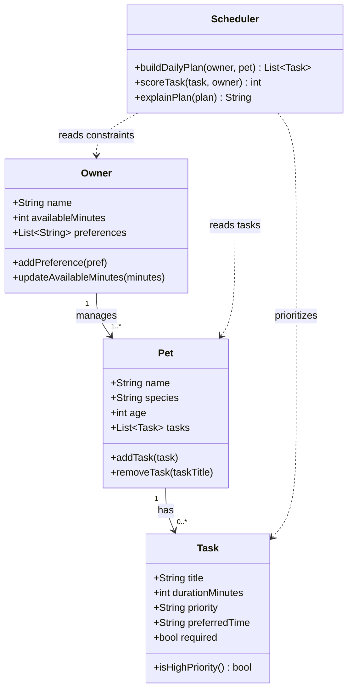

# PawPal+ Project Reflection

## 1. System Design

**a. Initial design**

My initial UML design focused on four core classes with clear responsibilities so the logic layer stays modular and easy to test.

- `Task` represents one care activity (for example feeding, walk, medication). It stores duration, priority, preferred time, and whether the task is required.
- `Pet` represents a single animal profile and owns the list of tasks that belong to that pet.
- `Owner` represents the person using the app and stores scheduling constraints such as available time and personal preferences.
- `Scheduler` is the decision-making class. It reads owner constraints and pet tasks, ranks tasks by importance/fit, and produces the final daily plan plus a short explanation.

The relationship model in the UML is: one owner manages one or more pets, each pet has zero or more tasks, and the scheduler depends on owner/pet/task data when generating the plan.

Here is the Mermaid.js class diagram representing this design:

**Core user actions**

- A user should be able to add and manage pet profiles so the system knows which pet needs care and what kind of care is appropriate.
- A user should be able to create and prioritize daily care tasks (like feeding, walks, medication, or playtime) with time estimates.
- A user should be able to generate and view today’s plan in order, so they can quickly see what to do next and when.

**b. Design changes**

Yes. I asked Copilot to review `#file:pawpal_system.py` for missing relationships and potential logic bottlenecks.

Based on that review, I made two refinements:

- I added the missing `Owner -> Pet` relationship in code by adding `pets` to `Owner` plus `add_pet` and `remove_pet` method stubs. This change keeps the implementation consistent with the UML association (`Owner "1" --> "1..*" Pet`).
- I added a `rank_tasks` method stub in `Scheduler` so task scoring/sorting can be centralized. The goal is to avoid scattering repeated scoring logic across multiple scheduling paths, which could become a bottleneck as task counts grow.

I made these changes to keep the design consistent, easier to maintain, and better prepared for scaling beyond a single pet or a very small task list.

---

## 2. Scheduling Logic and Tradeoffs

**a. Constraints and priorities**

- What constraints does your scheduler consider (for example: time, priority, preferences)?
- How did you decide which constraints mattered most?

**b. Tradeoffs**

- Describe one tradeoff your scheduler makes.
- Why is that tradeoff reasonable for this scenario?

---

## 3. AI Collaboration

**a. How you used AI**

- How did you use AI tools during this project (for example: design brainstorming, debugging, refactoring)?
- What kinds of prompts or questions were most helpful?

**b. Judgment and verification**

- Describe one moment where you did not accept an AI suggestion as-is.
- How did you evaluate or verify what the AI suggested?

---

## 4. Testing and Verification

**a. What you tested**

- What behaviors did you test?
- Why were these tests important?

**b. Confidence**

- How confident are you that your scheduler works correctly?
- What edge cases would you test next if you had more time?

---

## 5. Reflection

**a. What went well**

- What part of this project are you most satisfied with?

**b. What you would improve**

- If you had another iteration, what would you improve or redesign?

**c. Key takeaway**

- What is one important thing you learned about designing systems or working with AI on this project?
